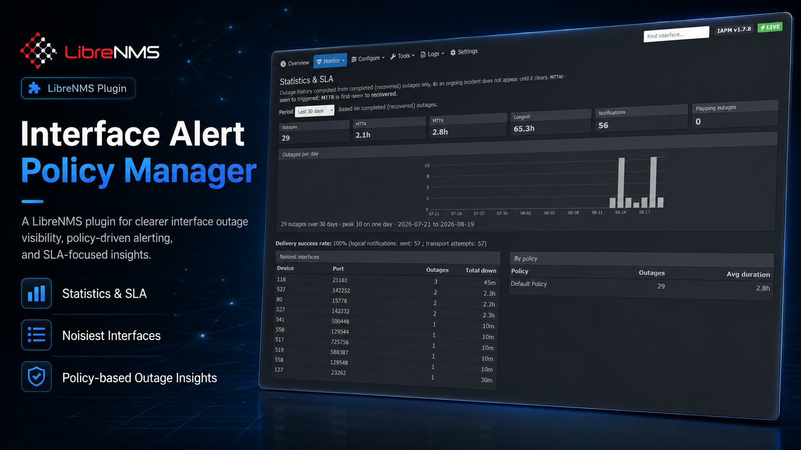

# Interface Alert Policy Manager (IAPM)



[](https://github.com/Drakelid/interface-alert-policy-manager/actions/workflows/ci.yml)
[](https://packagist.org/packages/drakelid/interface-alert-policy-manager)
[](LICENSE)

IAPM is a LibreNMS package plugin that turns one broad interface-down alert into independently managed per-`port_id` incidents. It resolves policy assignments, records decisions and delivery attempts, reconciles current port state, and owns SMS/webhook delivery.

## Quick start

For the impatient — install and enable, then finish configuration in the UI. See [Installation](#installation) for the full walkthrough and the production queue-worker setup.

```bash
cd /opt/librenms

# Record the plugin so LibreNMS updates cannot drop it.
# Merge this entry by hand if composer.plugins.json already exists.
sudo -u librenms tee composer.plugins.json >/dev/null <<'JSON'
{
    "require": {
        "drakelid/interface-alert-policy-manager": "^1.7"
    }
}
JSON

sudo -u librenms env FORCE=1 ./scripts/composer_wrapper.php require drakelid/interface-alert-policy-manager
sudo -u librenms php artisan migrate --force
sudo -u librenms ./lnms plugin:enable interface-alert-policy-manager
sudo -u librenms php artisan optimize:clear
sudo systemctl reload "php$(php -r 'echo PHP_MAJOR_VERSION.".".PHP_MINOR_VERSION;')-fpm"
```

Then open **Plugins → Interface Alert Policy Manager** and follow the Overview setup checklist: generate the ingestion token, add a destination, a policy with a notification action, and an assignment — then wire up the LibreNMS rule/template/transport from **Tools → Setup Helper**. Queued delivery and its workers start automatically. It begins in dry-run; turn that off when you're ready to send.

Once that configuration is done, `sudo -u librenms php artisan iapm:install-check` should be all green. Run it any earlier and it reports the setup checks as `[FAIL]` — that is the checklist telling you what is still missing, not a broken install.

## Compatibility discovered

The documented and CI-tested baseline is LibreNMS `26.7.0`, PHP 8.2–8.4, and Laravel `^12.10`. The package uses Laravel Composer discovery plus `librenms/plugin-interfaces`; `PluginManagerInterface::publishHook()` supplies menu/settings integration. IAPM references `App\Models\Device`, `Port`, `DeviceGroup`, `PortGroup`, `Location`, and related models directly without copying core models. LibreNMS alert states are `CLEAR/RECOVERED=0`, `ACTIVE=1`, `ACKNOWLEDGED=2`, `WORSE=3`, `BETTER=4`, and `CHANGED=5`.

## Installation

Follow these steps in order. At the end the plugin is fully operational and delivering notifications. All commands run on the LibreNMS host; `php artisan` and `lnms` must run as the `librenms` user.

The path, end to end:

| Step | What it does | Where |
|---|---|---|
| [1](#1-install-the-package-packagist) | Install the package and make it survive LibreNMS updates | shell |
| [2](#2-migrate-and-enable) | Create tables, enable the plugin, clear caches | shell |
| [3](#3-configure-the-essentials-ui) | Token, destination, policy + action, assignment | UI |
| [4](#4-point-librenms-at-iapm-setup-helper) | LibreNMS alert rule, template, and API transport | UI |
| [5](#5-delivery-workers-queued-dispatch-is-the-default) | Confirm queue workers are draining | shell |
| [6](#6-test-before-going-live) | Simulate an alert while still in dry-run | UI |
| [7](#7-go-live) | Turn dry-run off | UI |

`iapm:install-check` is the progress meter for steps 1–3 and exits 0 once step 3 is complete; its informational `alert_source` line turns green when step 4 delivers the first alert. Steps 5–7 are verified with `iapm:health` and the Overview health panel.

### Requirements

- **LibreNMS 26.x** (CI-tested against `26.7.0`) on Laravel 12+, with its scheduler running — the standard `* * * * * librenms /opt/librenms/lnms schedule:run` cron. IAPM's reconcile, action processing, and queue workers all rely on it. Step 4's alert-operation wiring is specific to 26.x.
- PHP 8.2, 8.3, or 8.4, and Composer.
- The LibreNMS database (MySQL/MariaDB). No extra service is required — the queue runs on the database by default; Redis is optional and only for scale.
- An SMS gateway (or webhook) reachable from the LibreNMS host.

### 1. Install the package (Packagist)

Two steps, and **both are required**. `composer.plugins.json` is what makes the
plugin survive `daily.sh`; the composer command alone does not, because
`daily.sh` runs `git checkout -- composer.json composer.lock` during an update
and then re-requires only the packages listed in `composer.plugins.json`.

```bash
cd /opt/librenms

# 1a. Record the plugin so updates cannot drop it.
#     Check first — this file may already list other plugins, and the command
#     below REPLACES it. If it prints anything, add the require entry by hand
#     instead of running the heredoc.
cat composer.plugins.json 2>/dev/null

sudo -u librenms tee composer.plugins.json >/dev/null <<'JSON'
{
    "require": {
        "drakelid/interface-alert-policy-manager": "^1.7"
    }
}
JSON

# 1b. Install it now.
sudo -u librenms env FORCE=1 ./scripts/composer_wrapper.php require drakelid/interface-alert-policy-manager
```

<sub>Verify the first step took effect with `sudo -u librenms php daily.php -f composer_get_plugins`; it must print `drakelid/interface-alert-policy-manager:^1.7`. If it prints nothing, `daily.sh` will remove the plugin on its next run. `composer_wrapper.php` is only a wrapper around composer itself — it writes to `composer.json`, never to `composer.plugins.json`. `^1.7` tracks 1.x releases from 1.7 up; pin it tighter (`~1.7.0`) if you want patch-only updates.</sub>

### 2. Migrate and enable

```bash
sudo -u librenms php artisan migrate --force          # IAPM tables + queue tables + scale indexes
sudo -u librenms ./lnms plugin:enable interface-alert-policy-manager    # if not already active
sudo -u librenms php artisan optimize:clear
sudo systemctl reload "php$(php -r 'echo PHP_MAJOR_VERSION.".".PHP_MINOR_VERSION;')-fpm"
sudo -u librenms php artisan iapm:install-check
```

<sub>The reload command derives your PHP-FPM unit from the CLI PHP version (`php8.4-fpm`, `php8.3-fpm`, …). Confirm the unit name with `systemctl list-units 'php*-fpm*'` if it differs, and skip the reload entirely if LibreNMS is not served through PHP-FPM.</sub>

At this point `iapm:install-check` reports the **system** checks green — `plugin_registration`, `migrations`, `encryption_key`, `writable_storage`, `scheduler_registration` — and the **setup** checks red: `ingestion_token`, `policy_exists`, `policy_action`, `default_policy`, `enabled_destination`, `sms_receiver`. That is correct here — step 3 is what turns them green. Each `[FAIL]` line prints the hint for fixing it, plus the command to run where one applies.

Refresh LibreNMS — **Plugins → Interface Alert Policy Manager** is now in the menu, starting in **dry-run** (nothing is sent until you go live in step 7).

### 3. Configure the essentials (UI)

Open the plugin and work down the **Overview setup checklist** (or the numbered **Configure** menu). Each step has a Fix button:

1. **Settings → generate the ingestion token** (top of the page).
2. **Destinations → create** your SMS gateway (URL, credentials, default receiver). Use *Send test* to confirm it reaches the gateway.
3. **Policies → create** a policy (trigger delay, repeats, recovery), then **add at least one notification Action** pointing at the destination — a policy with no action never notifies.
4. On that policy's **Interface assignments** section, add how interfaces map to it. A **Default** assignment covers every interface; or scope to specific devices/groups/port-groups/regex.
5. **Large fleets:** either set a default assignment/policy so nothing is unmatched, **or** Settings → turn **off** *Record alerts for interfaces with no policy* so un-scoped interfaces are ignored instead of stored.

### 4. Point LibreNMS at IAPM (Setup Helper)

Open **Tools → Setup Helper**. Copy the three blocks into LibreNMS alerting:

1. **Alert rule** — build it in the rule editor so LibreNMS validates it.
2. **Alert template** — paste as the rule's template.
3. **API transport** — an *API* transport (POST, "send as form" OFF) to the ingestion URL with the `Authorization: Bearer <token>` header; route the rule to it.

On LibreNMS 26.x the rule must also be attached to an **alert operation**, and the transport must be mapped to one of that operation's segments — that is where modern LibreNMS resolves transports from. A rule with no operation is silently muted (`Muted Alert-UID #<n>` in `alerts.php` output) and IAPM never receives anything. Building the rule in the rule editor sets this up for you; a rule inserted straight into `alert_rules` does not. See [docs/OPERATIONS.md](docs/OPERATIONS.md#librenms-alert-operations-26x).

The Setup Helper's **"Confirm it's working"** panel turns green once LibreNMS posts its first alert.

Re-run the readiness gate before continuing:

```bash
sudo -u librenms php artisan iapm:install-check   # now all green
```

`alert_source` ("LibreNMS is posting alerts") is reported as `[INFO]` rather than `[FAIL]`: it stays informational until LibreNMS posts its first alert and never affects the exit code, so the command already exits 0 once step 3 is done.

### 5. Delivery workers (queued dispatch is the default)

Queued delivery is on by default and **self-provisions**: the queue tables were created in step 2, and the scheduler keeps `IAPM_QUEUE_WORKERS` (default 3) background workers draining the queue — nothing else to do for a working setup. To confirm:

```bash
pgrep -af '[q]ueue:work.*--queue=iapm'  # workers appear within ~1 minute
sudo -u librenms php artisan iapm:health   # "Queue worker delivering" proves one is consuming work
```

<sub>That `pgrep` pattern assumes the default queue name; match `IAPM_QUEUE_NAME` if you changed it.</sub>

IAPM publishes on `IAPM_QUEUE_CONNECTION` when set, and on LibreNMS's default queue connection when it is not. Leaving it unset is fine as long as that default is a real asynchronous driver. Check it with `sudo -u librenms php artisan tinker --execute="echo config('queue.default');"` — if it prints `sync`, jobs run inline and the workers have nothing to consume, so pin the connection explicitly instead:

```bash
echo 'IAPM_QUEUE_CONNECTION=database' | sudo tee -a /opt/librenms/.env
cd /opt/librenms && sudo -u librenms php artisan config:clear
```

The `database` driver needs no extra service — step 2 created its tables. Scheduler-managed workers pick the change up on their next recycle, within a few minutes. Whatever you set here, **the workers must run on the same connection and queue as the publisher**; that is the single most common cause of a red `Queue worker delivering` check.

Each worker exits after `IAPM_QUEUE_WORKER_MAX_SECONDS` (default 240) and the next scheduler tick replaces it, so PIDs change every few minutes — that is the recycle, not a crash. Lifetimes are staggered so the workers never all exit on the same tick. The recycle also bounds recovery: a worker killed without releasing its overlap lock (OOM kill, container stop) is replaced within about 7 minutes rather than being blocked until the lock expires. Raising this value lengthens that outage proportionally.

Don't run `php artisan schedule:clear-cache` while these workers are running — it frees their overlap locks and leaves you with a permanently doubled worker set. See [Duplicate queue workers](docs/OPERATIONS.md#duplicate-queue-workers).

For a **production-hardened** setup (supervised, boot-persistent, auto-restarting workers), see [Rock-solid queue workers](#rock-solid-queue-workers-production) below and set `IAPM_QUEUE_WORKERS=0` so systemd owns the workers. To use synchronous delivery instead (no workers), Settings → *Delivery dispatch* → Synchronous.

### 6. Test before going live

With dry-run still on, fire a synthetic alert and confirm the pipeline without sending anything:

- **Tools → Synthetic Simulation** for one interface, then check the **Delivery Log** (rows show `dry_run`).
- **Tools → Policy Test** shows the effective policy and *who would be paged* for a given `port_id`.

### 7. Go live

Settings → turn **off Dry-run** (you'll be asked to confirm). Real notifications now flow. Watch the first genuine interface-down incident through the **Overview** and **Delivery Log**.

### Verify it's healthy

The **Overview health panel** should be all green, and:

```bash
sudo -u librenms php artisan iapm:health   # exits 0 when scheduler, gateway, backlog, and queue are healthy
```

Point external monitoring at `iapm:health` as a dead-man's switch.

#### How queue-worker health is decided

When delivery is queued, `iapm:health` proves a worker is alive rather than
inferring it. The scheduler enqueues a tiny **heartbeat job** on the same
connection and `iapm` queue as real notifications once a minute, and a worker has
to actually execute it to move the timestamp — so the check exercises settings →
connection → queue → worker → execution end to end.

This matters in both directions. A quiet network is not evidence of a problem:
health stays green for hours or days without a single notification, as long as
heartbeats keep being consumed. And an empty queue is not evidence of health:
with every worker stopped the queue is empty too, and the check still goes red
within `IAPM_QUEUE_HEARTBEAT_STALE_SECONDS` (default 300).

Worker liveness and notification backlog are reported separately — `Queue worker
delivering` covers the worker, `No stuck notifications` covers the outbox — so a
backlog is never misreported as a dead worker.

At most one heartbeat is outstanding at a time, so stopped workers cannot make
jobs pile up; a heartbeat that is somehow lost rather than merely waiting is
replaced after ten minutes so health can recover on its own. It works the same
whether workers are scheduler-managed (`IAPM_QUEUE_WORKERS=3`) or externally
supervised (`IAPM_QUEUE_WORKERS=0` with systemd or Supervisor), and on both the
`database` and `redis` queue connections.

---

### Rock-solid queue workers (production)

For large fleets, run the workers under **systemd** (auto-restart, boot-persistent, memory-capped) instead of the scheduler. First disable the scheduler-managed workers:

```bash
echo 'IAPM_QUEUE_WORKERS=0' | sudo tee -a /opt/librenms/.env
# optional: keep queue load off MySQL at scale
# echo 'IAPM_QUEUE_CONNECTION=redis' | sudo tee -a /opt/librenms/.env
cd /opt/librenms && sudo -u librenms php artisan config:clear
sudo -u librenms bash -lc 'command -v php'    # note the php path for the unit below
```

Install the worker template and start N instances (concurrency = instance count; match your gateway):

```bash
sudo tee /etc/systemd/system/iapm-worker@.service >/dev/null <<'UNIT'
[Unit]
Description=IAPM notification queue worker %i
After=network-online.target mariadb.service mysql.service redis-server.service
Wants=network-online.target
StartLimitIntervalSec=0

[Service]
Type=simple
User=librenms
Group=librenms
Restart=always
RestartSec=5
ExecStart=/usr/bin/php /opt/librenms/artisan queue:work --queue=iapm --name=iapm-%i --sleep=1 --tries=3 --backoff=15 --max-time=3600 --timeout=60
KillSignal=SIGTERM
TimeoutStopSec=120
MemoryMax=512M

[Install]
WantedBy=multi-user.target
UNIT

sudo systemctl daemon-reload
sudo systemctl enable --now iapm-worker@{1..6}
```

<sub>Adjust the `ExecStart` php path to match `command -v php`. **If `IAPM_QUEUE_CONNECTION` is set, pass the same connection as the first argument** — `queue:work redis …` or `queue:work database …`; the unit above omits it and therefore uses LibreNMS's default connection, which will not see IAPM's jobs if the publisher is on a different one. Set the queue connection's `retry_after` above the 60-second worker timeout (90 seconds or more). A destination's worst-case delivery (`1 + retry_count` attempts x request timeout, plus retry delays) must also fit inside the worker timeout — IAPM rejects destinations above ~80% of it (`IAPM_DELIVERY_BUDGET_RATIO`) and clamps attempts at delivery time, because a job killed mid-delivery is stale-reclaimed and resent. Transport failures remain in IAPM's durable outbox with backoff; Laravel process failures also appear in `failed_jobs`.</sub>

### Updating

`daily.sh` reinstalls the package from `composer.plugins.json`, so updates are automatic within your version constraint. After any update that changes code, restart the workers so they load it:

For a guarded end-to-end production update, copy `tools/update-production.sh` to the server and run `sudo bash update-production.sh`. It defaults to the latest compatible `^1.7` release; pass an exact release such as `sudo bash update-production.sh 1.7.8` to pin it. The script preserves other `composer.plugins.json` entries, backs up Composer metadata, stops and restores systemd IAPM workers, updates the package, migrates, clears caches, reloads PHP-FPM, queues a policy-cache rebuild, and runs both operational checks. Take a verified database backup first.

```bash
sudo -u librenms php artisan migrate --force
sudo -u librenms php artisan optimize:clear
sudo systemctl reload "php$(php -r 'echo PHP_MAJOR_VERSION.".".PHP_MINOR_VERSION;')-fpm"
sudo systemctl restart 'iapm-worker@*'        # or `php artisan queue:restart` for scheduler-managed workers
sudo -u librenms php artisan iapm:install-check && sudo -u librenms php artisan iapm:health
```

Back up the database before upgrades. To replace an installed copy safely, use
the [fresh uninstall and reinstall runbook](docs/FRESH_REINSTALL.md). Composer
removal preserves IAPM data; only an explicit migration reset deletes it.

### Development install (path repo)

For local development against a checkout instead of Packagist. Do **not** add a development install to `composer.plugins.json` — `daily.sh` would try to reinstall it from Packagist and you would end up with the plugin installed twice (see the ambiguous-class-resolution entry below).

```bash
cd /opt/librenms
sudo -u librenms php composer.phar config repositories.iapm '{"type":"path","url":"../interface-alert-policy-manager","options":{"symlink":true}}'
sudo -u librenms env FORCE=1 ./scripts/composer_wrapper.php require drakelid/interface-alert-policy-manager:@dev
sudo -u librenms php artisan migrate
sudo -u librenms ./lnms plugin:enable interface-alert-policy-manager
sudo -u librenms php artisan optimize:clear
sudo -u librenms php artisan iapm:install-check
```

<sub>Every command runs as `librenms`, including the composer ones — running them as root leaves `composer.json`, `vendor/`, and the caches owned by the wrong user. `composer` is usually not on the PATH on a LibreNMS host; use `php composer.phar` or the wrapper as shown, and see the troubleshooting entry below if it is somewhere else.</sub>

### Installation troubleshooting

**`env: 'composer': No such file or directory`, or composer commands seem to do nothing.**
On many LibreNMS hosts `composer` is not on the PATH (it's a phar), so bare `composer …` silently fails. Use the LibreNMS wrapper (`./scripts/composer_wrapper.php …`) for install/update, and for any *manual* composer step use the phar directly, e.g. `sudo -u librenms php /opt/librenms/composer.phar dump-autoload`. Find it with `sudo find /opt/librenms -maxdepth 2 -name 'composer*'`.

**`Ambiguous class resolution … InterfaceAlertPolicyManager … the first will be used` during `composer` dump / update.**
The plugin is installed **twice** — usually a leftover `vendor/librenms/interface-alert-policy-manager` (an old path-repo/dev install) next to the Packagist `vendor/drakelid/…`. "The first will be used" means the **old** copy wins, so you run stale code. Remove the old one:
```bash
cd /opt/librenms
grep -c "librenms/interface-alert-policy-manager" composer.json composer.plugins.json   # find where it's required
# delete that require from composer.json AND composer.plugins.json, then:
sudo -u librenms php /opt/librenms/composer.phar remove librenms/interface-alert-policy-manager   # if in composer.json
sudo rm -rf vendor/librenms/interface-alert-policy-manager
sudo -u librenms php /opt/librenms/composer.phar dump-autoload 2>&1 | grep -c InterfaceAlertPolicyManager   # want 0
```
If you previously ran a self-heal cron to survive updates (`/etc/cron.d/iapm`), delete it — Packagist + `composer.plugins.json` replaces it, and it will keep re-adding the old package: `sudo rm -f /etc/cron.d/iapm /opt/iapm/ensure-iapm.sh`.

**Notifications aren't delivered even though everything is green.**
Check the delivery mode and workers. `iapm:install-check` prints `delivery=queue` or `delivery=sync`:
- `delivery=sync` — sent inline by the scheduler; no workers needed. Fine, but no parallelism.
- `delivery=queue` — requires running workers. Confirm with `pgrep -af '[q]ueue:work.*--queue=iapm'`. If nothing is draining, jobs pile up in the `jobs` table. Either start workers (scheduler-managed needs `IAPM_QUEUE_WORKERS>0`; or the systemd units above) or switch to sync: Settings → *Delivery dispatch*.

**`iapm:health` reports `[FAIL] Queue worker delivering` while workers are running.**
The check reports a worker dead only when no heartbeat has been *consumed* within
`IAPM_QUEUE_HEARTBEAT_STALE_SECONDS`. A quiet network does not cause this. Work through:

1. Are the workers listening on the right queue and connection? The failure message
   names both. A worker started without `--queue=iapm`, or against a different
   connection than `IAPM_QUEUE_CONNECTION`, will never see the heartbeat.
   `systemctl status 'iapm-worker@*'` shows the actual `ExecStart`.
2. Is the LibreNMS scheduler running? If the message says *no new heartbeat is
   queued*, nothing is enqueueing them — the `Reconciliation running` and
   `Action processing running` checks will be red too.
3. Did the workers load current code? After an upgrade, restart them:
   `sudo systemctl restart 'iapm-worker@*'`.
4. Enqueue one by hand to watch it move: `sudo -u librenms php artisan iapm:queue-heartbeat`,
   then re-run `iapm:health`.

Do **not** start an extra `php artisan queue:work` by hand to clear this. If systemd
or Supervisor already owns the workers, a stray one masks the real fault and is lost
on the next reboot.

To read or change the mode from the CLI:
```bash
sudo -u librenms php artisan tinker --execute="\$s=app(LibreNMS\Plugins\InterfaceAlertPolicyManager\Services\SettingStore::class); echo \$s->get('dispatch_mode','queue').PHP_EOL;"
sudo -u librenms php artisan tinker --execute="app(LibreNMS\Plugins\InterfaceAlertPolicyManager\Services\SettingStore::class)->put('dispatch_mode','queue');"
```

**`Table 'librenms.jobs' doesn't exist`.** Queued delivery needs the queue tables — run `php artisan migrate --force` (the plugin ships the migration). IAPM deliberately does not turn a broken asynchronous backend into blocking gateway calls: the encrypted outbox stays pending and `iapm:drain-outbox` republishes it after the queue is restored.

**`install-check` shows `[FAIL] default_policy`.** Decide coverage: add a **Default** assignment (or set a default policy) so unmatched interfaces are covered, **or** Settings → turn off *Record alerts for interfaces with no policy* to intentionally ignore them (recommended when you scope IAPM to specific interfaces).

**Plugin missing from the menu / "must be run as the user librenms".** Run `artisan`/`lnms` as `sudo -u librenms`. If the plugin vanished after an update, confirm it's in `composer.plugins.json` (that's what `daily.sh` reinstalls from) and that `vendor/drakelid/interface-alert-policy-manager` exists; re-run step 1 if not.

**Queue heartbeat is not consumed.** `IAPM_QUEUE_WORKERS=0` deliberately disables
the scheduler-managed worker pool; use it only when systemd, Supervisor, or a
container starts equivalent workers. If `pgrep -af '[q]ueue:work.*--queue=iapm'`
prints nothing, either restore a positive worker count and run
`php artisan config:clear`, or start the configured external worker service.

**Alert POSTs return 419 or 404, or no IAPM routes appear in `php artisan route:list`.** The routes are cached from before the plugin was installed — common on container images, which ship a prebuilt `bootstrap/cache/routes-v7.php`. Run `sudo -u librenms php artisan optimize:clear` (step 2) and reload PHP-FPM. Until the cache is cleared the ingest URL falls through to LibreNMS's own web routes, so CSRF rejects it with 419 rather than a clearer 401/404.

## Configuration and security

Create a cryptographically random ingestion token (at least 32 random bytes), store it under `ingestion_token` in encrypted IAPM settings, and use a short overlap in `previous_ingestion_token` during rotation. Destination configuration uses Laravel encrypted casts. Environment placeholders are supported, but encrypted database configuration is preferred for administration. Never put credentials in a URL.

IAPM starts in dry-run mode. Private/reserved destination addresses are blocked unless `allow_private_networks` is explicitly enabled for the trusted internal SMS gateway. HTTP(S) only is permitted. Authorization uses LibreNMS authentication with administrator fallback and distinct IAPM abilities. Browser writes use CSRF; the machine endpoint is outside the browser middleware and uses its dedicated bearer token and throttling.

SMS destination fields: URL, username, password, default receiver, JSON/form mode, connection/request timeouts, retries, retry delay, TLS verification, optional safe headers, and `allow_private_networks`. JSON mode is the default and sends `{"receiver":"...","message":"..."}`. Basic credentials are never written to delivery logs.

Receiver precedence is policy-action override, metadata on the single winning assignment, policy default, destination default/list, then global default. Losing assignments never contribute receivers. Device digests union the per-incident result of that same resolver, so policy and assignment overrides survive aggregation. No delivery occurs without a valid receiver. Templates support explicit `{{ placeholder }}` substitutions and safe conditional blocks: `{{#if ifAlias}}...{{else}}...{{/if}}`, `{{#if severity == "critical"}}...{{/if}}`, `!=`, `contains`, and `not contains`. Combine up to 10 requirements with `&&`, for example `{{#if ifAdminStatus == up && ifOperStatus == down}}down{{else}}not down{{/if}}`; every requirement must match. Use `{{#if device_groups contains "Production"}}...{{/if}}` for group membership. For convenience, `device_groups == "Production"` also matches one exact member when the device belongs to multiple groups. Conditions may be nested up to 10 levels. Unknown placeholders and invalid syntax fail validation; no PHP or Blade is executed.

IAPM renders the selected template, applies the administrator-managed **SMS Content Filters**, and sends the complete result to the SMS gateway without truncation. Filters are case-insensitive words/phrases or exact symbols; a trailing `*` removes a matching token prefix such as `Bundle-Ether10`. They apply only to SMS destinations and never alter LibreNMS inventory, policy matching, stored templates, or generic webhook messages. The Template Preview includes the active filters and reports the final character count, while the gateway controls final length and segmentation. Built-in templates place the potentially verbose interface description last so core details reach gateways first.

The available placeholders are `incident_id`, `severity`, `state`, `hostname`, `sysName`, `display_name`, `device_id`, `device_groups`, `port_id`, `ifName`, `ifDescr`, `ifAlias`, `ifAdminStatus`, `ifOperStatus`, `interface_type`, `location`, `policy_name`, `assignment_source`, `first_seen_at`, `triggered_at`, `recovered_at`, `outage_duration`, `device_url`, `port_url`, `acknowledgement_user`, and `suppression_reason`. `device_groups` is a comma-separated list of every LibreNMS device group containing the device, or an empty string when it has none. `device_url` and `port_url` are built from the `url_base` setting, which defaults to the application URL. Template preview and real SMS delivery use the same placeholder map and content-filter service.

Destination tests are explicit administrator actions: they send even while dry-run mode is enabled, and every attempt is written to the delivery log with phase `test` and no incident.

Deleting a destination is refused, with the reason shown, while anything still references it: a policy action, unfinished outbox work, or delivery history belonging to an incident. Incident history is never deleted to make a destination removable — it leaves with its incident when `iapm:cleanup` passes `retention_days`. The incident-less `test` rows above are the exception: nothing else ever prunes them, so they are deleted together with the destination, and the confirmation says so. Bulk delete applies the same rules per row and skips the ones that are still referenced instead of failing the batch.

## Alert rule and transport

Create one LibreNMS rule whose fault query selects ports where the device is up, `ifAdminStatus = up`, `ifOperStatus != up`, and `ignore`, `disabled`, and `deleted` are false. Verify field names in the rule builder for the installed version.

POST JSON to:

```text
/plugin/interface-alert-policy-manager/api/v1/alerts
Authorization: Bearer <generated-token>
Content-Type: application/json
Accept: application/json
```

Use LibreNMS's JSON encoding in the alert template rather than manually quoting fault strings. The payload must contain `device_id`, state, and a `faults` array with stable `port_id` values. See `samples/active-alert.json` and `samples/recovery-alert.json`. State 0 is recovery; 1/3/4/5 are active observations; 2 is acknowledged.

Identifiers may arrive as JSON numbers or as numeric strings; both are normalized. A payload whose state is not a supported LibreNMS alert state is refused with a structured `422` rather than an error page. A recovery payload must carry `alert_id`, `alert_uid`, or `rule_id` so the affected incidents can be correlated.

The verified rule expression for this checkout is:

```text
macros.device_up = 1 AND ports.ifAdminStatus = 'up' AND ports.ifOperStatus != 'up' AND ports.ignore = 0 AND ports.disabled = 0 AND ports.deleted = 0
```

Use `samples/librenms-alert-template.blade.php`; it constructs an array from the documented `$alert` fields and encodes it with Blade `@json`, preserving quotes, newlines, Unicode, multiple faults, and empty recoveries. `samples/librenms-api-transport.md` contains the transport fields. The same content is available from the plugin Setup page.

## Policies and lifecycle

Administration forms take names, not internal ids: low-cardinality sets (destinations, device groups, locations and port groups) are selects, and devices, interfaces, incidents and users are debounced type-aheads that submit the id while displaying the name. The Interface Matrix shows and copies each `port_id` and links each row to Policy Test, Simulate Alert and the LibreNMS port page, for the tools that still accept a raw id.

Assignment precedence is port, port group, device, device group, location, ifAlias regex, ifName regex, interface type, default. Ties use assignment priority, policy priority, then newest assignment. Device-group assignments support `any`, `all`, and `exclude`. Incidents begin pending, become active when delay/poll requirements pass, may be suppressed or acknowledged, and finally recover. The stable key is `interface-down:{device_id}:{port_id}`.

Commands:

```sh
php artisan iapm:install-check [--gateway]
php artisan iapm:reconcile [--dry-run] [--incident=ID] [--device=ID]
php artisan iapm:process-actions [--incident=ID] [--action=ID] [--force]
php artisan iapm:test-policy --port=PORT_ID
php artisan iapm:test-destination --destination=ID --receiver=VALUE [--force]
php artisan iapm:cleanup [--force]
php artisan iapm:cache-clear
php artisan iapm:cache-rebuild [--device=DEVICE_ID]
php artisan iapm:drain-outbox [--limit=N]        # scheduled every minute; republishes due outbox rows
php artisan iapm:drain-ingestion [--limit=N] [--worker=N]   # scheduled; replays the durable ingestion inbox
php artisan iapm:queue-heartbeat   # scheduler runs this every minute; safe to run by hand
php artisan iapm:recover-simulations   # scheduled; restores port state left behind by a Real Simulation
php artisan iapm:health   # non-zero exit when IAPM is unhealthy (for external monitoring)
```

`reconcile`, `process-actions`, `drain-outbox`, `drain-ingestion`, `queue-heartbeat`, `recover-simulations`, the hourly `cache-rebuild`, and the nightly `cleanup --force` all run from the LibreNMS scheduler already; the entries above are for manual inspection and troubleshooting.

## Noise control, monitoring, and tooling

- **Root-cause suppression.** Designate an *uplink port group* in Settings, then enable "suppress when uplink down" on a policy. When an uplink interface on a device is down, downstream customer interfaces on that device are suppressed (reason `uplink_down`) instead of storming.
- **Flap dampening (per policy).** Set a flap threshold, window, and settle period. When an interface cycles down/up faster than the threshold, IAPM sends one `FLAPPING` notice and suppresses the routine churn until it settles.
- **Device digest (storm control).** Set an *aggregate threshold* (and window) in Settings. When at least that many interfaces on the **same device** trigger within the window, IAPM sends one grouped "device down" message (device-level receivers) instead of an SMS per interface, so a linecard or downstream-switch failure produces one notification rather than a hundred. Wording is customisable on the Message Templates page. Set the threshold to `0` to always notify per interface. When an upstream LibreNMS acknowledgement arrives it acknowledges the incident rather than re-triggering it.
- **Escalation chains.** Add multiple `escalation` actions with increasing delays and different destinations/receivers; acknowledging the incident stops further escalation.
- **Queued dispatch (default, self-provisioning).** A durable encrypted outbox is committed before a queue job containing only the outbox ID is published. Its unique episode/action/phase/destination/receiver key prevents scheduler overlap and worker retry from creating another logical notification. Workers atomically claim rows; a crash leaves a reclaimable row, and `iapm:health` reports stale claims and overdue pending work. Publication failure leaves the row pending—never synchronous—and `iapm:drain-outbox` republishes due rows. HTTP 429 honors `Retry-After`; other failures use exponential backoff with jitter. Tune `IAPM_QUEUE_WORKERS` (default 3) to gateway capacity, or use Redis via `IAPM_QUEUE_CONNECTION=redis`. Switch to **Synchronous** in Settings only for small installations; both modes use the same outbox.
- **Durable storm ingestion.** Webhooks with at least `IAPM_INGEST_ASYNC_THRESHOLD` faults (default 1,000), plus whole-device recovery webhooks, are encrypted into `iapm_ingestion_inbox` and receive HTTP 202 only after commit. Scheduler-managed inbox workers replay them idempotently. `IAPM_INGEST_MAX_PENDING` provides explicit HTTP 503/`Retry-After` backpressure instead of dropping accepted alerts. Tune worker count first; `IAPM_INGEST_BATCH_PER_WORKER` (default 1, maximum 100) is available only after staging proves that processing multiple payloads per pass leaves database headroom.
- **Self-monitoring.** The Overview shows an IAPM health panel, and `iapm:health` exits non-zero when the scheduler has stalled, the gateway is failing, notifications are stuck, or no queue worker has consumed the once-a-minute liveness heartbeat — point your own monitoring at it as a dead-man's switch.
- **Statistics & SLA** (Monitor → Statistics): MTTA/MTTR, longest outage, notifications, flapping outages, noisiest interfaces, per-policy breakdown, and delivery success rate, computed from an append-only `iapm_outages` record.
- **Synthetic Simulation** (Tools): inject an observation without changing LibreNMS port state; useful for fast policy/assignment/suppression checks (respects dry-run).
- **Real Simulation** (Tools): temporarily overlays one healthy test interface with a selected admin/oper status combination, creates a real IAPM incident, runs real actions/queue/gateway delivery, and automatically restores the original state and sends recovery. The four combinations support operational-failure, administrative-suppression, healthy-state, and edge-case scenarios. It uses a single browser confirmation, refuses ports that are not healthy or already have an incident, persists every run, and provides an emergency **Recover now** action. Use only an isolated test interface. This validates IAPM end to end after ingestion; because it does not physically shut a switch port, SNMP polling and LibreNMS's alert transport still require one final hardware test.
- **Import / Export** (Tools): back up or promote policies, actions, and assignments as JSON between installs. Destinations are excluded (they hold secrets); actions are matched to destinations by name on import. Version 1 exports from older releases remain accepted, but their retired custom-schedule data is ignored.
- **Comparison report** gains a per-policy breakdown and CSV export.

The provider schedules reconciliation and action processing every minute and cleanup daily. Ensure `php artisan schedule:run` is executed every minute by the normal LibreNMS scheduler. While the plugin is disabled, its routes return `404` and the scheduled commands exit without acting, so disabling the plugin is a safe way to stop IAPM without removing it.

Before production cutover, complete every step in `docs/MANUAL_TEST.md` on a staging clone and retain the results with the change record.

## Dry-run cutover

Install IAPM, configure the SMS destination, create a default policy and assignments, keep `dry_run=true`, send alerts to IAPM while retaining direct LibreNMS SMS, compare incidents and delivery logs, correct missing policies/receivers, perform a controlled destination test, set `dry_run=false`, then disable the old direct SMS operation. Confirm one trigger and recovery before broad rollout.

## Logs, backup, and limitations

Incidents, timelines, deliveries, and audit history live in `iapm_*` tables; include them in database backups. IAPM structured operational logs are written to `storage/logs/iapm.log`. Credentials, tokens, authorization headers, and full responses are redacted or omitted.

### Backup and restore

Back up all `iapm_*` tables together with the LibreNMS application encryption key. Encrypted destination and setting values cannot be recovered with the database alone. Restore into the same LibreNMS/application-key environment, run migrations, clear/rebuild IAPM caches, and run `iapm:install-check` before enabling live delivery.

The notification outbox also contains encrypted receiver/message payloads until retained rows are cleaned. Rotate `APP_KEY` only with Laravel's supported previous-key mechanism and keep the old key available until all destination settings and outstanding outbox rows have been read and re-encrypted or expired. Losing the old key makes queued payloads undecryptable; stop workers, restore the key, and retry rather than deleting live rows.

### Running at large scale (100k+ interfaces)

IAPM is built to scale to very large fleets, but a few things must be configured deliberately:

- **Set a default assignment/policy _or_ turn off "Record alerts for interfaces with no policy"** (Settings). Otherwise every alerting interface without a matching policy is stored as a suppressed `no_policy` incident — at hundreds of thousands of interfaces that is a lot of rows. Scope IAPM to the interfaces you care about, then disable `record_unpoliced` so the rest are ignored.
- **Tune the ingestion rate limit.** `iapm.ingestion.rate_limit` (env `IAPM_INGEST_RATE`, default `20000,1`) caps all of LibreNMS's alert POSTs together. A 429 is explicitly retryable but LibreNMS must be configured to retry it; firewall the endpoint to the LibreNMS host and size the limit to the fleet's burst rate.
- **Enable the device digest** (`aggregate_threshold`) so a device dropping many interfaces sends one message instead of hundreds, and consider **queued dispatch** for very wide simultaneous events.
- **Policy cache refreshes automatically every hour** for the Interface Matrix policy/source/no-policy filters. The per-request/reconcile cache writes remain disabled to keep the hot paths write-light. The matrix also has a **Rebuild cache** button (queued, with progress) for changes you need reflected immediately, and `iapm:cache-rebuild` does the same from the CLI. Rebuilding is not automatic on each save because it is O(every port).
- Recovered incidents are retained (`retention_days`, default 365) and cleaned up in batches nightly; process-actions only re-scans recoveries from the last 48h, so old history doesn't slow the every-minute run.

### Known limitations

- Materialized policy filters are complete only after a cache rebuild has covered the relevant ports (Interface Matrix → **Rebuild cache**, or `iapm:cache-rebuild`). Queued rebuilds use time-bounded batches and checkpoint progress; tune `IAPM_CACHE_REBUILD_BATCH_SIZE`, `IAPM_CACHE_REBUILD_MAX_SECONDS`, and `IAPM_CACHE_REBUILD_CHECKPOINT_EVERY` only after measuring a representative fleet.
- Delivery is queued by default. Scheduled discovery is time-budgeted and cursor-resumable; large storms should use the device digest, durable outbox, and supervised Redis workers.
- Parent suppression uses current LibreNMS device relationships and cannot infer dependencies not modeled in LibreNMS.
- Private-network destinations must be explicitly allowed and should be limited to trusted internal gateway hosts.

### Future extensions

The transport contract supports future email, Teams Workflow, Slack, Alertmanager, and ticket-system transports. New transports must implement encrypted configuration, redaction, SSRF controls where applicable, controlled test delivery, and per-attempt delivery logging.

## Permissions

IAPM defines abilities for viewing the plugin, managing policies, assignments, destinations and settings, acknowledging or muting incidents, testing destinations, and viewing audit logs. LibreNMS administrators receive these abilities through the administrator fallback. Non-administrators must receive the corresponding Spatie/LibreNMS permissions; hiding a menu item never replaces route authorization.

## Upgrade and uninstall

Back up the database and application key, update the Composer package, run `php artisan migrate`, rebuild the policy cache, and run `iapm:install-check`. Never edit or reorder a migration already deployed. To disable safely, enable dry-run, restore the prior LibreNMS transport if needed, then disable the plugin. Composer removal does not intentionally delete tables. Only run migration rollback when permanent data deletion is approved and backed up.

For exact commands to remove the previous package copy and install it cleanly,
including worker shutdown and verification, follow
[Fresh uninstall and reinstall](docs/FRESH_REINSTALL.md).

This safety upgrade is additive: it preflights stable episode IDs in restartable batches, creates the encrypted durable ingestion inbox, adds storm-path indexes, and makes successful outbox finalization repairable. During rollout, stop the scheduler/workers, back up all `iapm_*` tables and `APP_KEY`, migrate, run the install check, drain one inbox/outbox row, then restart one worker and confirm health before restoring normal concurrency. See `docs/UPGRADING.md` for rollback and release-note details.

## Troubleshooting

- `401`: confirm the bearer token and rotation window; generate a new token if its value is unknown.
- `422`: inspect the structured field list without logging the request token or gateway credentials.
- Missing policy: run Policy Test, rebuild the cache, then review assignment precedence and enabled state.
- Missing recovery: run `iapm:reconcile --dry-run --incident=ID`, check polling freshness and recovery hold-down, then reconcile normally.
- Failed delivery: filter the Delivery Log, verify DNS/TLS/routing, and use a controlled destination test.
- Stuck pending: verify trigger delay, direct observation count, current port state, and scheduler execution.
- Duplicate notification: compare incident/action/receiver/attempt rows and confirm only one live LibreNMS-to-IAPM transport and one scheduler runner exist.

Detailed outage, credential-rotation, rollback, and gateway runbooks are in `docs/OPERATIONS.md`; development and extension guidance is in `docs/DEVELOPMENT.md`.

## License

Interface Alert Policy Manager is licensed under
[GNU GPL v3 or later](LICENSE) (`GPL-3.0-or-later`).
